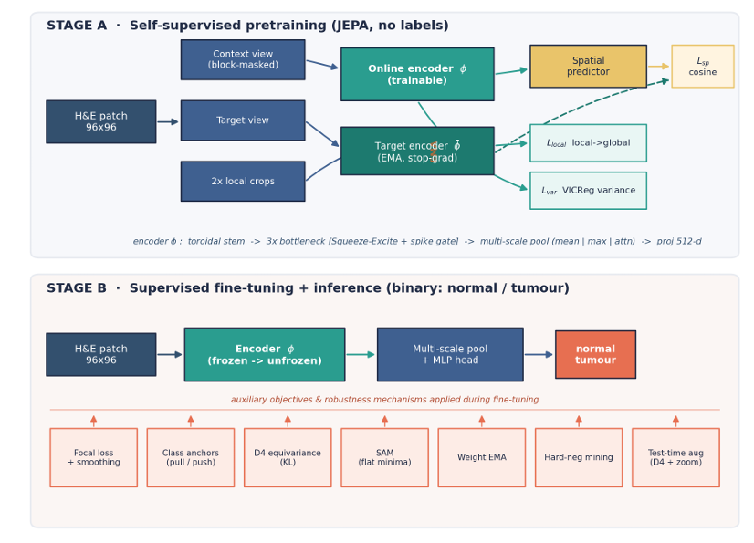
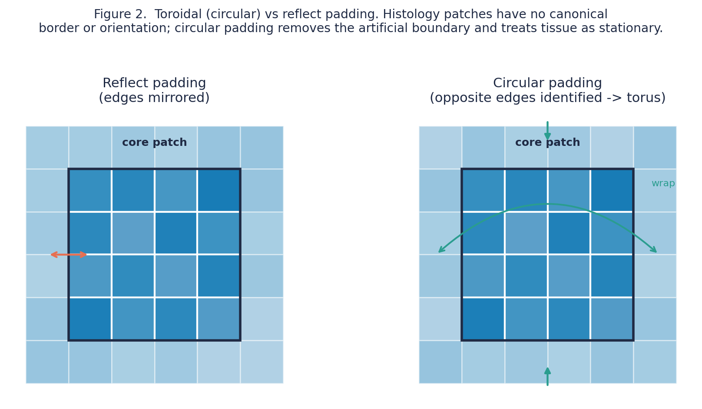
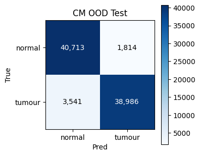
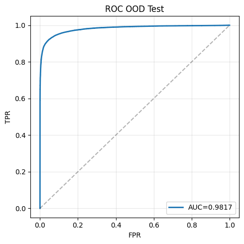
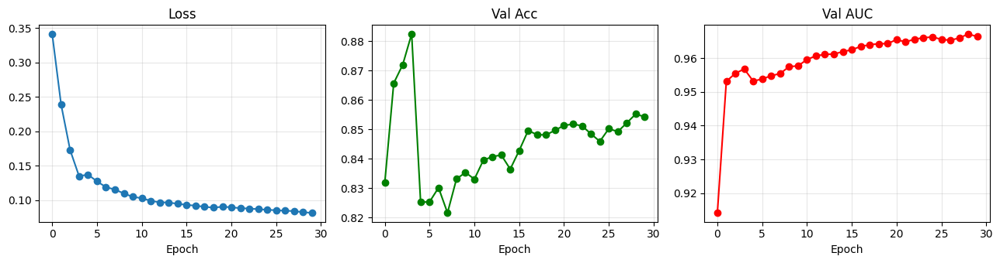
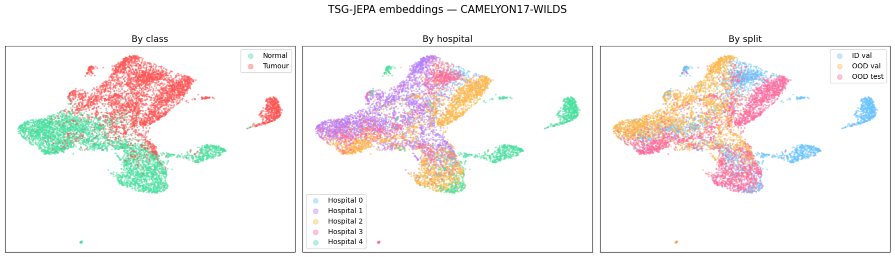
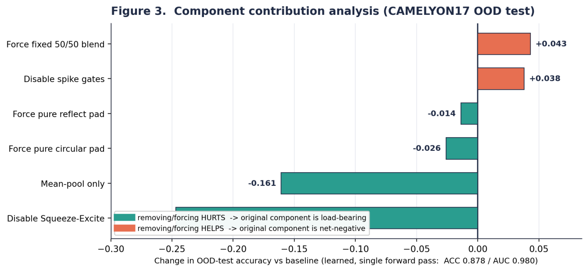
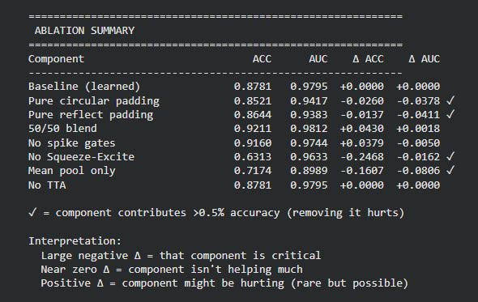
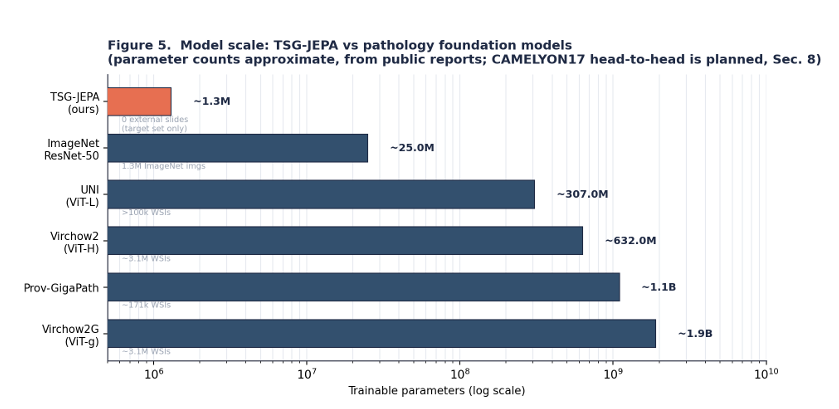
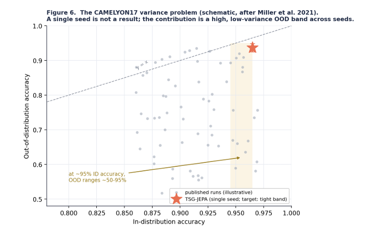

# TSG-JEPA

**A compact toroidal Joint-Embedding Predictive Architecture for distribution-robust tumour detection in histopathology.**

TSG-JEPA — *"japatoidal"* = **JEPA** + **toroidal** — is a **~1.3M-parameter** convolutional encoder trained **from scratch**: no ImageNet, no pathology foundation model, and no hospital/domain labels. The target task is binary tumour detection on **CAMELYON17-WILDS**, the canonical cross-hospital domain-shift benchmark in computational pathology.

> **Single-seed result on the official out-of-distribution test split (two unseen hospitals):**
> **AUC 0.982 · 93.7% accuracy · 91.7% sensitivity · 95.7% specificity** — at ~1.3M parameters and **zero external pre-training data**.
>
> ⚠️ These are **single-seed** numbers. CAMELYON17 is defined by its seed variance, so seed-averaged results with error bars are the next milestone (see [Roadmap](#roadmap)).

---

## Architecture

*Two stages, one encoder: **(A)** label-free JEPA self-supervised pretraining; **(B)** supervised fine-tuning and inference.*

Three ideas define the model:

- **Toroidal convolution.** Every convolution treats the patch as a torus — a fixed 50/50 blend of a circular-padded and a reflect-padded kernel — because a histology patch is borderless, orientation-free texture, not a centred object.
- **JEPA self-supervision.** The encoder learns by predicting masked regions in *representation* space (not pixels), so it is never asked to reproduce stain colour. An EMA target encoder and a VICReg variance term prevent representational collapse.
- **Cyclic-translation equivariance.** The encoder is trained so that wrap-shifting a patch on the torus shifts its feature map identically — turning the toroidal prior from a passive padding choice into an active mechanism.

Fine-tuning adds focal loss + label smoothing, learned class anchors, D4 / toroidal invariance, Sharpness-Aware Minimisation (flat minima), weight EMA, hard-negative mining, and test-time augmentation — each targeting a specific cross-hospital failure mode.

---

## The toroidal convolution — in motion

  <video src="https://github.com/DannyDOcean/TSG-JEPA/raw/main/assets/toroidal_convolution.mp4" controls muted loop width="60%" poster="https://github.com/DannyDOcean/TSG-JEPA/raw/main/assets/video_poster.png"></video>

> &#9654; If the inline player does not load, **[watch the animation here](https://github.com/DannyDOcean/TSG-JEPA/raw/main/assets/toroidal_convolution.mp4)**.

Circular padding turns a 96&times;96 H&E patch into a **torus** — opposite edges are identified, so a 3&times;3 kernel sweeps every pixel with **no artificial boundary**. A histology patch is borderless, orientation-free texture rather than a centred object, which is exactly why this is the right inductive bias.

*Reflect padding mirrors the edges (left); circular padding wraps them into a torus (right). The ablation found a **fixed 50/50 blend** of the two beats a learned one.*

---

## Results (single-seed run)

**Out-of-distribution test — confusion matrix & ROC**

  
  

*85,054 patches across two hospitals unseen in training. AUC 0.9817; 3,541 missed tumours vs 1,814 false alarms.*

**Fine-tuning dynamics**

**Learned embedding space (UMAP)**

*Normal vs tumour separate cleanly while the five hospitals stay intermixed within each class — domain invariance emerging **without any domain labels**.*

**Ablation — what actually drives performance**

  

Squeeze-excite attention and multi-scale pooling are the load-bearing components; a **fixed 50/50** toroidal blend beats a *learned* one; the spiking gates were net-negative and have been removed. Honest takeaway: the gains come from a fixed toroidal prior + channel attention + multi-scale pooling + the JEPA objective + flat-minima optimisation — not from the neuro-inspired extras.

**Efficiency positioning**

*~1.3M parameters, versus the hundreds-of-millions-to-billions of contemporary pathology foundation models. A head-to-head OOD comparison is planned.*

**The variance context**

*At fixed in-distribution accuracy, CAMELYON17 OOD accuracy fans across tens of points. A single seed lands somewhere in that band; the goal is a **high, tight band** across seeds.*

---

## Repository contents

| File | What it is |
|---|---|
| `TSG_JEPA.ipynb` | Full Colab notebook: data download → SSL pretraining → fine-tuning → evaluation. |
| `TSG-JEPA_Research_Report.pdf` | Internal research report: methods, ablation, threats to validity, roadmap. |
| `assets/toroidal_convolution.mp4` | 3D animation of the toroidal convolution (kernel sweeping the torus). |
| `assets/` | Result figures and paper diagrams used in this README. |

## Running it

Open `TSG_JEPA.ipynb` in **Google Colab** with a **GPU** runtime and run the cells top to bottom. CAMELYON17-WILDS downloads automatically. Training uses **seed 42**.

## Roadmap

- Seed-averaged OOD results (8–10 seeds) reported as mean ± standard deviation.
- First-party baselines in one harness: ERM-from-scratch, an ImageNet fine-tune, and a frozen pathology foundation model + linear probe.
- Quantify domain invariance (a hospital linear probe on frozen embeddings) and calibration (ECE + a high-sensitivity operating point).
- Stain-space self-supervision (optical-density / Macenko–Vahadane) and multi-magnification JEPA.

## Author

**Daniel D Holmes**

## Acknowledgements

Built on CAMELYON17-WILDS (Koh et al., 2021; Bandi et al., 2018). The method draws on JEPA (Assran et al., 2023), BYOL / DINO, VICReg (Bardes et al., 2022), and Sharpness-Aware Minimisation (Foret et al., 2021).

## License

Released under the MIT License — see [`LICENSE`](LICENSE).
