# TSG-JEPA

**A compact toroidal Joint-Embedding Predictive Architecture for distribution-robust tumour detection in histopathology.**

TSG-JEPA — *"japatoidal"* = **JEPA** + **toroidal** — is a **~1.3M-parameter** convolutional encoder trained **from scratch**: no ImageNet, no pathology foundation model, and no hospital/domain labels. The target task is binary tumour detection on **CAMELYON17-WILDS**, the canonical cross-hospital domain-shift benchmark in computational pathology.

> **Four-seed evaluation on the official out-of-distribution test split (two unseen hospitals):**
> accuracy is **93.70–94.04%** and AUC is **0.9783–0.9789** across random seeds 42, 123, 456, and 789 — at ~1.3M parameters and **zero external pre-training data**.

## TSG-JEPA in 30 seconds

  <video src="https://github.com/DannyDOcean/TSG-JEPA/raw/main/assets/TSG-JEPA_30s_1080p.mp4" controls playsinline width="80%"></video>

> &#9654; If the inline player does not load, **[play the 30-second overview](https://github.com/DannyDOcean/TSG-JEPA/raw/main/assets/TSG-JEPA_30s_1080p.mp4)**.

---

## Architecture

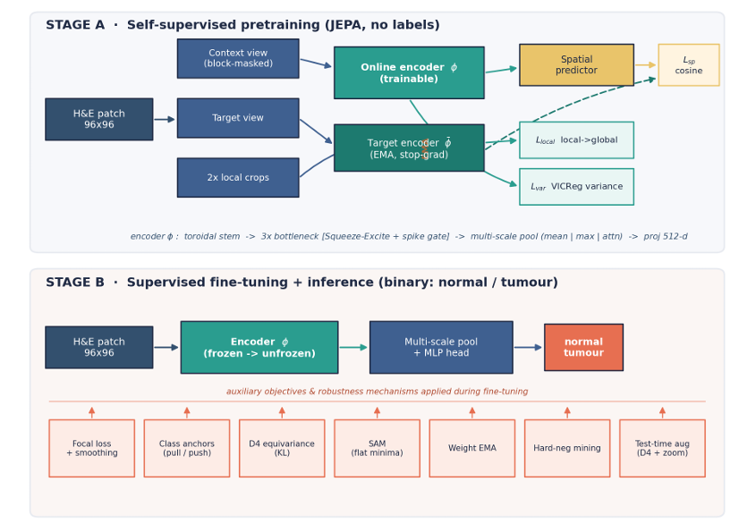

*Two stages, one encoder: **(A)** label-free JEPA self-supervised pretraining; **(B)** supervised fine-tuning and inference.*

Three ideas define the model:

- **Toroidal convolution.** Every convolution treats the patch as a torus — a fixed 50/50 blend of a circular-padded and a reflect-padded kernel — because a histology patch is borderless, orientation-free texture, not a centred object.
- **JEPA self-supervision.** The encoder learns by predicting masked regions in *representation* space (not pixels), so it is never asked to reproduce stain colour. An EMA target encoder and a VICReg variance term prevent representational collapse.
- **Cyclic-translation equivariance.** The encoder is trained so that wrap-shifting a patch on the torus shifts its feature map identically — turning the toroidal prior from a passive padding choice into an active mechanism.

Fine-tuning adds focal loss + label smoothing, learned class anchors, D4 / toroidal invariance, Sharpness-Aware Minimisation (flat minima), weight EMA, hard-negative mining, and test-time augmentation — each targeting a specific cross-hospital failure mode.

---

## Circular and Reflective Padding

Circular padding connects the left edge to the right edge and the top edge to the bottom edge. Reflective padding mirrors nearby boundary values. TSG-JEPA processes both branches and combines their outputs to preserve cross-boundary continuity while retaining local edge structure.

The feature maps remain ordinary 2D tensors; the torus is a mathematical visualisation of boundary connectivity, not a physical 3D reshape.

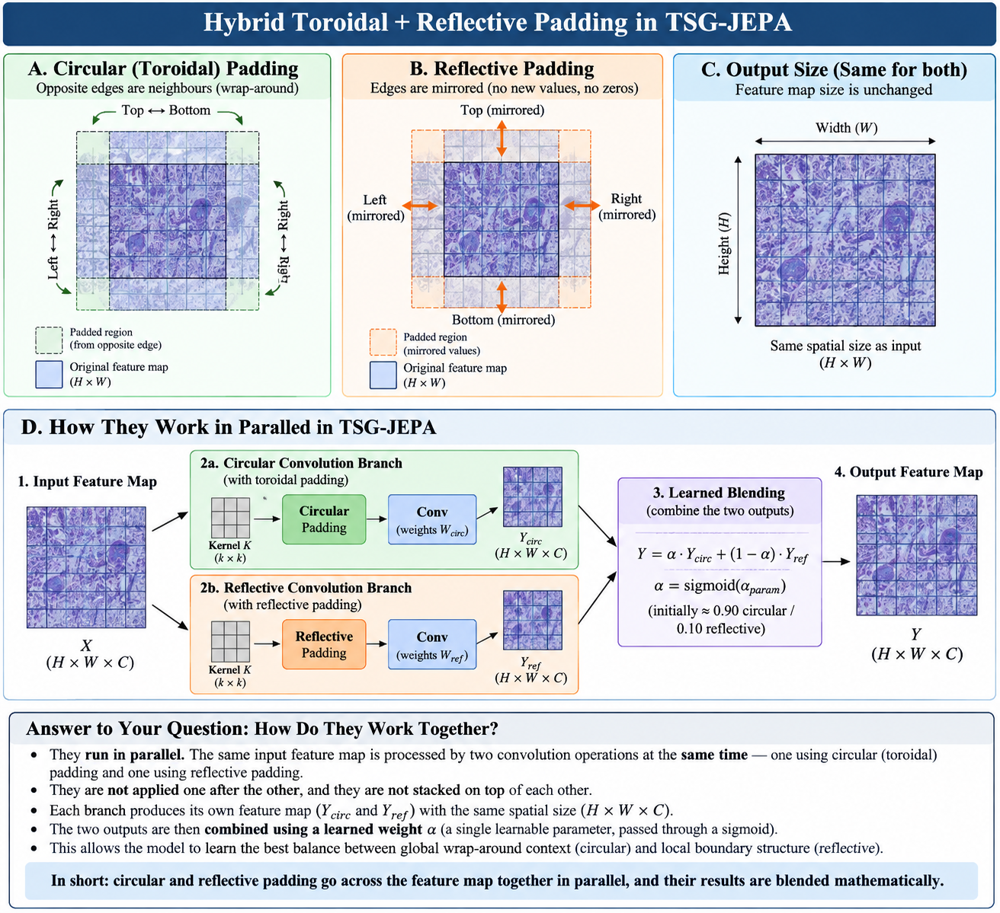

### The toroidal convolution — in motion

  <video src="https://github.com/DannyDOcean/TSG-JEPA/raw/main/assets/toroidal_convolution.mp4" controls muted loop width="60%" poster="https://github.com/DannyDOcean/TSG-JEPA/raw/main/assets/video_poster.png"></video>

> &#9654; If the inline player does not load, **[watch the animation here](https://github.com/DannyDOcean/TSG-JEPA/raw/main/assets/toroidal_convolution.mp4)**.

Circular padding treats a 96&times;96 H&E patch as a **torus** for boundary connectivity: opposite edges are identified so a 3&times;3 kernel can cross the image boundary without zero padding. This is a mathematical boundary condition applied to an ordinary 2D feature map.

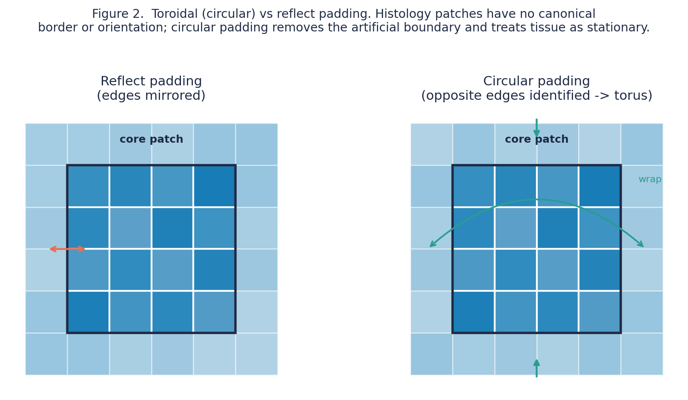

*Reflect padding mirrors the edges (left); circular padding wraps them into a torus (right). The ablation found a **fixed 50/50 blend** of the two beats a learned one.*

---

## Four-seed OOD-test benchmark

The runs are listed in the required sequential order; metrics are reported exactly as evaluated.

| Run | Seed | Accuracy | AUC | Sensitivity | Specificity | Precision | F1 |
|---|---:|---:|---:|---:|---:|---:|---:|
| Seed 1 | 42 | 93.71% | 0.9783 | 92.49% | 94.93% | 94.80% | 93.63% |
| Seed 2 | 123 | 93.71% | 0.9783 | 92.49% | 94.93% | 94.80% | 93.63% |
| Seed 3 | 456 | 94.04% | 0.9783 | 93.22% | 94.87% | 94.79% | 93.99% |
| Seed 4 | 789 | 93.70% | 0.9789 | 92.99% | 94.41% | 94.33% | 93.65% |

### Evaluation visualisations

The supplied figures are grouped by sequential run and random seed. Embedding projections are descriptive 2D views; visual clustering alone does not establish domain invariance.

#### Seed 1 — random seed 42

  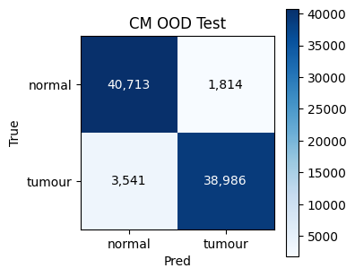
  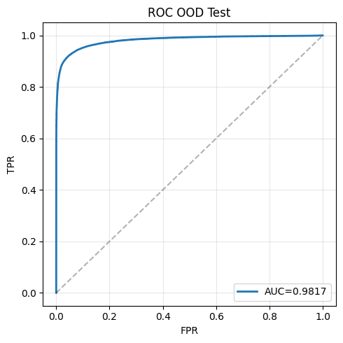

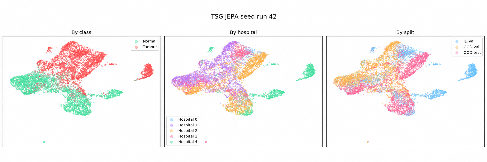

[Seed 1 training curves](assets/evaluation/seed_1_42/training_curves.png)

#### Seed 2 — random seed 123

  
  

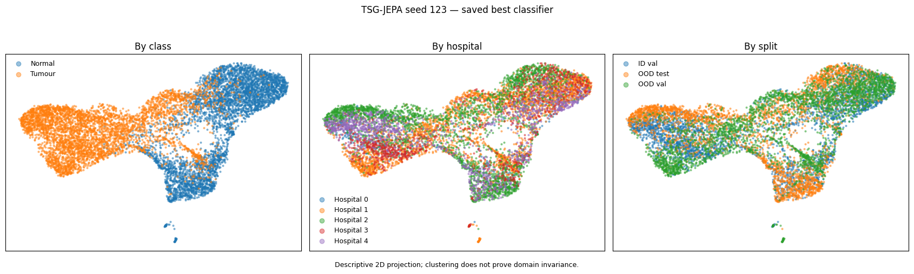

[Seed 2 training curves](assets/evaluation/seed_2_123/training_curves.png)

#### Seed 3 — random seed 456

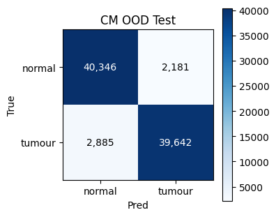

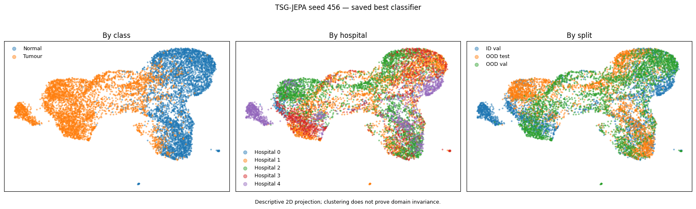

[Seed 3 training curves](assets/evaluation/seed_3_456/training_curves.png)

#### Seed 4 — random seed 789

  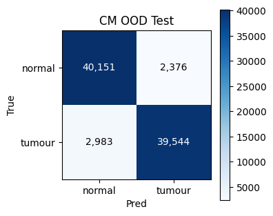
  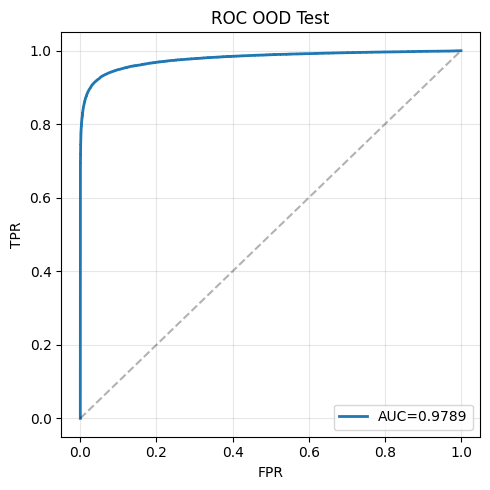

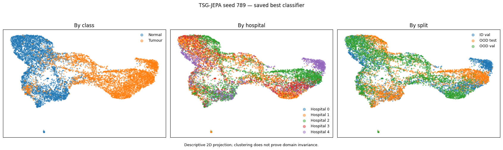

**Ablation — what actually drives performance**

  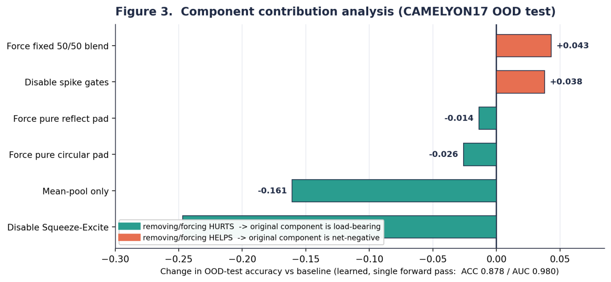

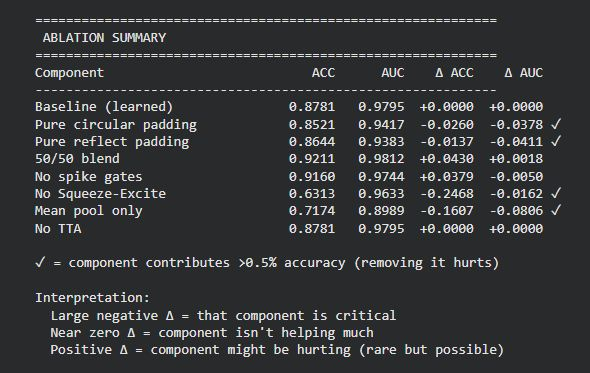

Squeeze-excite attention and multi-scale pooling are the load-bearing components; a **fixed 50/50** toroidal blend beats a *learned* one; the spiking gates were net-negative and have been removed. Honest takeaway: the gains come from a fixed toroidal prior + channel attention + multi-scale pooling + the JEPA objective + flat-minima optimisation — not from the neuro-inspired extras.

**Efficiency positioning**

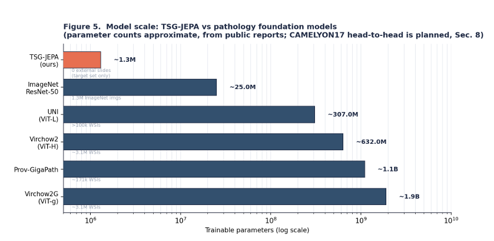

*~1.3M parameters, versus the hundreds-of-millions-to-billions of contemporary pathology foundation models. A head-to-head OOD comparison is planned.*

**The variance context**

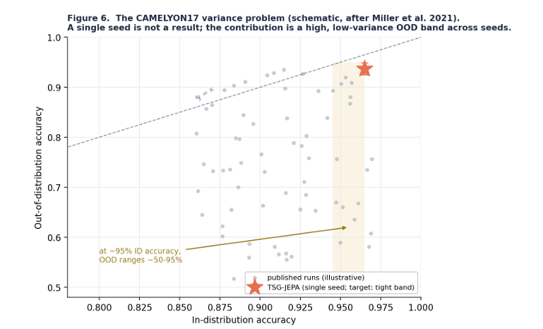

*At fixed in-distribution accuracy, CAMELYON17 OOD accuracy fans across tens of points. A single seed lands somewhere in that band; the goal is a **high, tight band** across seeds.*

---

## Repository contents

| File | What it is |
|---|---|
| `TSG_JEPA.ipynb` | Full Colab notebook: data download → SSL pretraining → fine-tuning → evaluation. |
| `TSG-JEPA_Research_Report.pdf` | Internal research report: methods, ablation, threats to validity, roadmap. |
| `assets/TSG-JEPA_30s_1080p.mp4` | 30-second project overview. |
| `assets/toroidal_convolution.mp4` | 3D animation of the toroidal convolution (kernel sweeping the torus). |
| `assets/circular_reflective_padding.png` | Diagram of the circular and reflective padding branches and their combined output. |
| `assets/evaluation/seed_1_42/` | Evaluation figures for Seed 1 (random seed 42). |
| `assets/evaluation/seed_2_123/` | Evaluation figures for Seed 2 (random seed 123). |
| `assets/evaluation/seed_3_456/` | Evaluation figures for Seed 3 (random seed 456). |
| `assets/evaluation/seed_4_789/` | Evaluation figures for Seed 4 (random seed 789). |
| `assets/` | Result figures and paper diagrams used in this README. |

## Running it

Open `TSG_JEPA.ipynb` in **Google Colab** with a **GPU** runtime and run the cells top to bottom. CAMELYON17-WILDS downloads automatically. Training uses **seed 42**.

## Roadmap

- Extend the four-seed OOD benchmark to 8–10 seeds and report mean ± standard deviation.
- First-party baselines in one harness: ERM-from-scratch, an ImageNet fine-tune, and a frozen pathology foundation model + linear probe.
- Quantify domain invariance (a hospital linear probe on frozen embeddings) and calibration (ECE + a high-sensitivity operating point).
- Stain-space self-supervision (optical-density / Macenko–Vahadane) and multi-magnification JEPA.

## Author

**Daniel D Holmes**

## Acknowledgements

Built on CAMELYON17-WILDS (Koh et al., 2021; Bandi et al., 2018). The method draws on JEPA (Assran et al., 2023), BYOL / DINO, VICReg (Bardes et al., 2022), and Sharpness-Aware Minimisation (Foret et al., 2021).

## License

Released under the MIT License — see [`LICENSE`](LICENSE).
